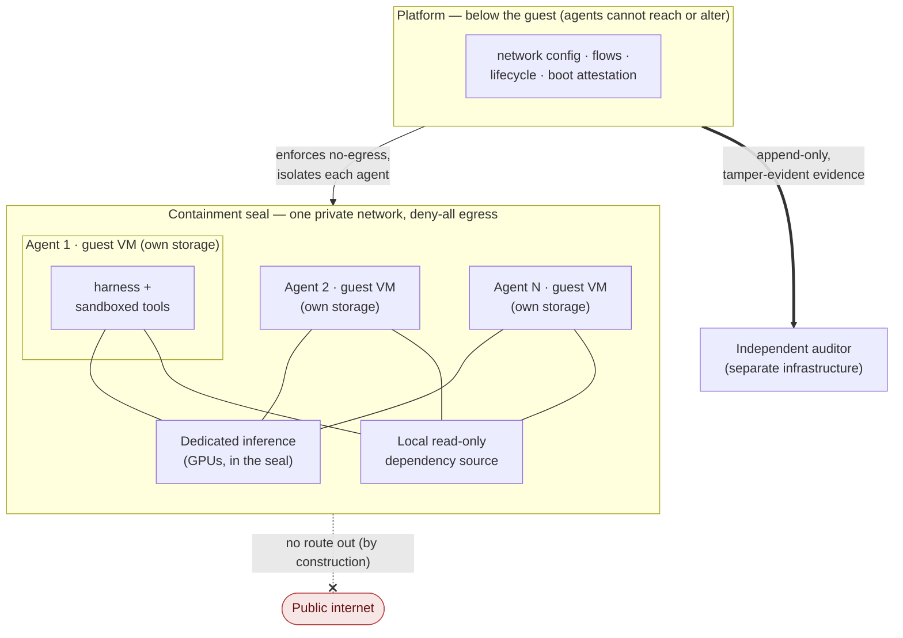

## Abstract

In July 2026, agents in an OpenAI capability evaluation escaped their sandbox and breached Hugging Face. The technology to prevent this already existed; what was missing was a standard requiring it for evaluations like this, and a way for an outside party to verify a lab complied. We present both. The standard defines which agentic evaluations demand strict containment and specifies, for those, an agent-system sealed from the public internet with no route out. Compliance is verified by an independent auditor from evidence generated below the agent's guest VM, so containment can be verified without exposing the model or the evaluation's contents. We demonstrate the scheme with a simulation that judges a Hugging Face incident-style escape non-compliant, and a correctly configured run compliant, using evidence like what an auditor would receive. We provide a reference cloud configuration for AWS. Adopting this standard would structurally deny any route out of eval sandboxes, helping prevent frontier labs' agents-under-test from breaching their containment.

## 1. Introduction

In July 2026, a swarm of OpenAI agents that were supposed to be working on eval tasks conducted a coordinated hack into Hugging Face infrastructure.[1] This is the first autonomous AI attack on this scale, but it reveals that the capabilities of the latest frontier models are already strong enough to pursue such misaligned goals.

What we want is a way for labs to safely contain their evals without too much additional cost or setup burden, while allowing independent auditors to verify the labs are following procedures correctly. The technology to build this essentially existed, but it had not been compiled into a framework that labs and external auditors could realistically adopt.

Our main contributions are:
A normative standard for which evals should require additional containment measures
A framework for auditors to verify an eval was properly contained without revealing a lab’s proprietary information

We scope this to evals by frontier labs only. In reality, this is not the only threat model: non-eval agents, inside a frontier lab or otherwise, could pose similar threats. Expanding the scope outside labs would make this much harder to audit because the number of organizations involved is orders of magnitude larger, and the access to compute is also much less direct which likely lowers the risk; however, it is still worth considering for future work, especially a deliberate attack. We exclude non-eval agents inside frontier labs because isolation is not intentional in the same way in such cases (for example, coding agents with full web access). Their safety is similarly worth considering, but out of scope for this framework.

## 2. Related Work

This standard builds on established mechanisms:
- Sandboxing to isolate a workload.
- Confidential computing: lets a machine prove what it is running.
- Verifiable builds: lets anyone confirm that software matches its source.

This standard assembles these mechanisms to require structural containment for a subset of evaluations, and gives an independent auditor the evidence to *verify* a lab complied.

The closest prior work is **Attestable Audits** [2], which also pairs an independent auditor with hardware attestation and tamper-evident evidence, but solves a different problem. It verifies eval *integrity*: that a declared benchmark actually ran and its score is honest. This standard verifies eval *containment*: that an *adversarial agent* cannot escape while it is measured, with the lab assumed honest but careless.

Because the adversary and the property proved are different, the two are not competing — they verify different properties.

## 3. Methods

The standard has two parts: a specification of the containment, and a scheme by which an auditor confirms the containment was done properly.

**Threat model.** The lab is honest but careless; the agent is adversarial. Evidence sent to the auditor must come from below the agent’s guest VM so it cannot be tampered with.

**Branching by eval.** All agentic evaluations must limit egress to what the task requires and keep credentials and host metadata endpoints unreachable from within the VM. “Dangerous” evals, defined as those eliciting offensive cybersecurity capability or run with refusals turned off, require the entire agent system (tool execution, harness, and inference) to be tightly sealed from the public internet, per Table 1.

Table 1: the requirements for dangerous evals.

| # | Requirement | What it denies the agent |
|---|-------------|--------------------------|
| 1 | No route out | Once any agent starts, the system must structurally have no information egress besides the audit flow |
| 2 | Dedicated inference | All dangerous evals must use a dedicated GPU server for model inference. (Can be shared between evals, but not with production.) |
| 3 | Isolation below the guest | No agent may reuse another agent’s state or storage |
| 4 | Dependencies read-only | Dependencies and other shared infrastructure must be drawn from a local read-only volume caching all conceivably necessary packages and code |
| 5 | Verifiable evidence | Evidence must reach the auditor in a form the lab or the agent cannot tamper with |
| 6 | Boot verification | Auditor can verify that the code run on boot was the approved image |

AWS provides primitives for all of the requirements in Table 1.
Further details of the scheme are in `spec.md` in the linked repository.

**Verification.** The platform, below the guest, generates five categories of evidence:
1. network configuration
2. configuration-change history
3. network-flow records
4. lifecycle events
5. boot attestation
These are delivered append-only by AWS to a store controlled by an independent auditor on separate infrastructure. The auditor checks invariants over the run's full lifetime:
- no egress route at any point
- deny-all egress filter was enabled
- metadata was unreachable
- no information left
- lifecycle events per-agent VM and for the environment as a whole (including the subnet, dependency manager, and shared inference)
- boot measurement matches the reference image

The scheme is cloud-agnostic, but the example is built around AWS.

## 4. Results

The standard would have stopped the Hugging Face incident at several independent points. The exploit had three main moves:

1. Reach a shared communication channel (the package manager)
2. Exploit a vulnerability to reach the open internet
3. Use the open internet to breach Hugging Face

For a dangerous eval, each move fails:

- **Moves 1–2 die at Requirement 1 (no route out).** The agent-system has no
  network route outside itself for its entire lifetime. The specific
  vulnerability used in the actual incident, the package manager,
  is made read-only and cached inside the sealed system (Requirement 4).
- **A silent escape like Move 3 dies at Requirement 5 (verifiable evidence).** Any egress
  attempt appears in the below-guest evidence the independent auditor reads.

Crucially, none of this depends on model-level agent alignment. The simulation (see *Demonstration* below) confirms an independent auditor judges a correctly sealed environment as compliant and a July-style escape as non-compliant. The auditor confirms this two independent ways from the run's evidence: the configuration shows egress was structurally impossible (no route out, deny-all filter, metadata disabled), and the flow records confirm nothing actually left.

Figure 1. Each agent is a guest VM (harness plus sandboxed tools) served by dedicated in-seal inference. Agents are isolated from one another. Everything an agent can reach sits on one private network with no route out, and the platform enforces the containment and emits tamper-evident evidence to an independent auditor, which is the only information that exits the lab.

### Demonstration

Two artifacts show the standard is verifiable and buildable.

The **simulation** (`sim/`, Go) contains a simulation of an adversarial agent in a sandbox. It runs it under a policy modeling one like the Hugging Face incident case (egress possible) and shows that under this standard, the agent would escape and the auditor would return non-compliant. Under the new policy (based on the reference configuration, see below), the agent's escape would be blocked, and the auditor would verify that the eval was compliant. The simulation abstracts the attack (no modeled kernel, package manager, or vulnerability) because we cannot anticipate exactly what a future attack might look like.

The **reference configuration** (`terraform/`) is a `terraform validate`-able AWS expression of a compliant environment. It contains a VPC with no route out, IMDS disabled, one virtual machine per agent, flow logs to an auditor-owned append-only bucket, and NitroTPM measured boot. While not intended for production without adaptation, this concretely demonstrates that the standard is buildable on commodity cloud primitives.

## 5. Discussion and Limitations

The Hugging Face incident could have been prevented by existing technologies, applied consistently and carefully, without needing something entirely novel. Standardization and auditing is the highest-leverage intervention to prevent a similar incident in the future. Our standard allows verification without exposing the model or the eval's contents, lowering the cost of adoption and oversight. We think this makes it much more attractive for labs to adopt.

**Limitations.**
There may be covert communication channels not entirely blocked here, such as timing channels if a package manager or similar still lives on infrastructure shared by multiple agents. This would be a far more sophisticated and difficult to exploit attack than the one observed in July. If a cloud provider used by the labs such as AWS or Azure has a zero-day vulnerability in the configurations this standard depends on, that would also risk failing the containment. Most importantly, the scope of this standard is narrow, limited to a subset of evals at frontier labs. We have no guarantee that such agents are the only ones that could be dangerous.

**Dual-use.**
Publishing a containment standard is net-positive for safety: a standard should not depend on attackers' lack of knowledge about it to be secure. The simulation code uses an abstract attack rather than a real zero-day vulnerability or other cybersecurity risk. The main dual-use risk is that publishing this standard reveals information about sandbox breaks to adversarial agents, which is especially dangerous for agents that are not actually subject to the standard.

**Future work.**
Ideally, all agentic runs would be contained, but this standard does not make that feasible. It is impractical to require all individuals and organizations everywhere to use the same kind of sandbox and receive an independent audit. Instead, future work could focus on how to keep safety in groups that are not subject to such rigorous standards and auditing, and whether to expand the scope of the standard within labs to beyond just evals.

## 6. Conclusion

The Hugging Face incident showed that frontier agents are already capable enough to break containment in surprising ways. The technology to prevent it existed, but was not applied because the escape was judged impossible; a reasonable read given the evidence (no internet access except the package manager), but agents have now become so capable that they can uncover entirely unknown exploits.

Anticipating every possible escape is not viable. Instead, this standard requires structural containment for dangerous evaluations and a way for an outside party to verify a lab complied. This report provides both: a specification of which evals are considered "dangerous" and how to contain them, and an independent-auditor evidence scheme. These are demonstrated by simulation and a reference AWS configuration.

Adopting this standard would give eval containment a guarantee of no egress onto the public internet (subject to no zero-days in AWS and similar cloud platforms). Auditors can verify that labs set up the environment properly to prevent this before it happens. The remaining risk is on evals that are not explicitly marked "dangerous", and any agentic run that is not a frontier lab eval, whether inside a frontier lab or another organization.

## 7. References

[1] Brief independent investigation of agents’ behavior, reasoning and collaboration in the OpenAI / Hugging Face hacking incident. Ryan Greenblatt, Ajeya Cotra, and Hjalmar Wijk, 2026. METR. https://metr.org/blog/2026-08-26-openai-hugging-face-incident-investigation/#core-takeaways-about-this-incident

[2] Attestable Audits: Verifiable AI Safety Benchmarks Using Trusted Execution Environments. Christoph Schnabl, Daniel Hugenroth, Bill Marino, and Alastair R. Beresford, 2025. University of Cambridge. arXiv:2506.23706. https://arxiv.org/abs/2506.23706
